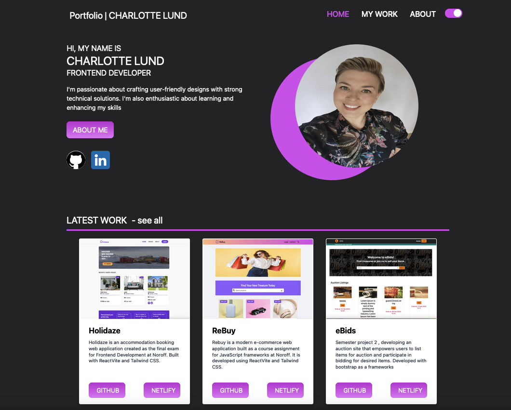

# Portfolio-2



## Description

[Portfolio](https://portfolio-charlottelund.netlify.app/): Who am I, my project and contact info.

This portfolio showcases some of my assignments completed during my time at Noroff. Each project includes a live link and corresponding GitHub repository for convenient access to my work. Should you have any inquiries or wish to explore potential collaborations, please don't hesitate to reach out using the provided contact information


## Built with
- Vite
- React
- TailwindCSS

## Getting started

### Installation

1. Clone the project

```
https://github.com/chalund/portfolio-2.git
```

2. Install NPM packages

```
npm install or yarn install
```

3. Start the project

```
npm start
```

### Run the application

1. Start the development server

```
npm run dev
```

2. View in Browser
   Open the provided localhost link in your preferred web browser

## Deployed Sites

Netlify Deployment, [Portfolio](https://portfolio-2-charlottelund.netlify.app/)

## Contact

[](https://pe.linkedin.com/in/charlotte-lund-48419b249/)
[](https://github.com/chalund)
[](mailto:chalund@gmail.com)
